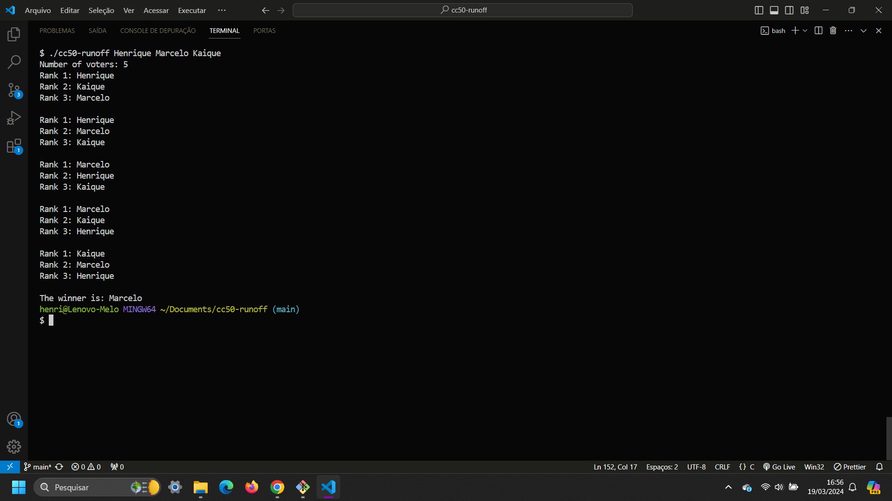

# RUNOFF ELECTION

### What is it?

An instant runoff election is a voting system in which voters can choose multiple candidates in order of preference. This system is used to ensure that the winning candidate has the most support possible.

1. Voters rank candidates according to their preferences, assigning a numerical order to each candidate. For example, the voter may indicate the preferred candidate as "1", the second preferred candidate as "2", and so on.

2. Initial Vote Count: In the initial count, the first choices of all voters are considered.

3. Majority Check: If a candidate receives an absolute majority (more than half) of the votes in the initial count, he is declared the winner.

4. Elimination and Transfer of Votes: If no candidate obtains an absolute majority in the first round, the candidate with the lowest number of votes is eliminated. That candidate's votes are then transferred to the remaining candidates according to the second choices indicated by voters on their ballots.

5. Recount and Majority Verification: After the transfer of votes, a new count is carried out to check whether any candidate obtained an absolute majority of votes. If not, the process of elimination and transfer of votes continues until one candidate reaches an absolute majority.

Este sistema é conhecido por garantir que o candidato vencedor tenha um amplo apoio entre os eleitores, já que leva em consideração as preferências de segunda escolha dos eleitores. Ele é usado em várias eleições em todo o mundo para promover uma representação mais justa e precisa da vontade dos eleitores.

## Example in VScode terminal:

